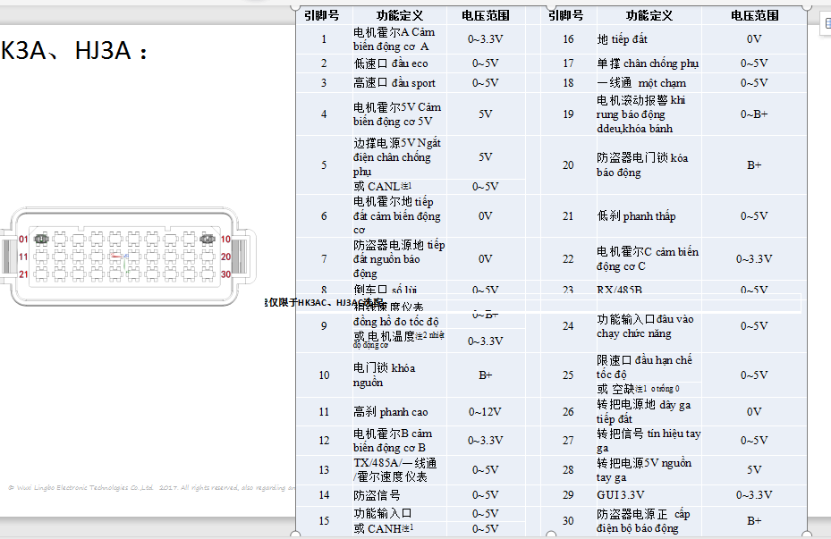

# Development Environment Info #
- Toolchain : GNU Tools ARM Embedded .
- nrf SDK : ver14.

# Setup environment variables #
- add $(SAVY_GCC_PATH) into environment variables with link folder `C:/Program Files (x86)/GNU Tools ARM Embedded/x.x xxxx/bin`

# Makefile #
- Use "make" to compile code 
```
	make 
``` 
- Use "make flash " to flash firmware
```
	make flash
```
- Use "make help" to show rules in Makefile
```
	$ make help
	following targets are available:
	Pega
	flash_softdevice
	sdk_config - starting external tool for editing sdk_config.h
	flash - flashing binary
```
- Use "make flash_softdevice" to flash firmware soft device
```
	make flash_softdevice
```
- Use "make sdk_config" to editing file sdk_config.h
```
	make sdk_config
```

# Flash code by Jlink#
- add folfer `CommanderScript` and create file :
	+ build_unix.jlink
	+ build_windows.jlink
	+ erase_unix.jlink
	+ erase_windows.jlink
	+ sd_unix.jlink
	+ sd_windows.jlink
- Or download [link](https://drive.google.com/open?id=1qCnWuSdcfI-upwXL5AUr0oc_JZm9ljY9) then add in the same level Makefile, src, sdk.

# Diagram Pin Out of ECU #
	
